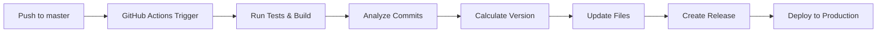

# 🚀 Automated Versioning System

## Overview

This project uses **semantic-release** with **GitHub Actions** for fully automated versioning based on commit messages. Every push to `master` triggers an automated release process that:

- ✅ Analyzes commit messages to determine version bump
- ✅ Updates `package.json` version automatically  
- ✅ Generates `CHANGELOG.md` with release notes
- ✅ Creates GitHub releases with tags
- ✅ Builds and deploys the updated site

## 🎯 How It Works

### Commit Message → Version Bump

The system follows **Conventional Commits** to determine version increments:

```bash
# Patch version (1.0.0 → 1.0.1) - Bug fixes
fix: resolve mobile layout issue
fix(ui): correct button alignment

# Minor version (1.0.0 → 1.1.0) - New features
feat: add dark mode toggle  
feat(projects): add new showcase section

# Major version (1.0.0 → 2.0.0) - Breaking changes
feat!: redesign navigation structure
fix!: change API response format

# No version bump - Maintenance
docs: update README
chore: update dependencies
ci: fix build script
```

### Commit Types

| Type | Description | Version Impact |
|------|-------------|----------------|
| `feat` | New feature | Minor bump |
| `fix` | Bug fix | Patch bump |
| `feat!` or `fix!` | Breaking change | Major bump |
| `docs` | Documentation | No bump |
| `chore` | Maintenance | No bump |
| `ci` | CI/CD changes | No bump |
| `test` | Tests | No bump |
| `refactor` | Code refactor | No bump |

## ⚙️ GitHub Actions Workflow

### File: `.github/workflows/release.yml`

```yaml
name: Release

on:
  push:
    branches:
      - master  # Triggers on every push to master

permissions:
  contents: write      # To create releases and tags
  issues: write        # For release notes
  pull-requests: write # For release notes

jobs:
  release:
    name: Release
    runs-on: ubuntu-latest
    steps:
      - name: Checkout
        uses: actions/checkout@v4
        with:
          fetch-depth: 0  # Full history for semantic-release
          
      - name: Setup Node.js
        uses: actions/setup-node@v4
        with:
          node-version: '20'
          cache: 'npm'
          
      - name: Install dependencies
        run: npm ci
        
      - name: Run tests and build
        run: |
          npm run lint    # ESLint check
          npm test       # Jest tests
          npm run build  # Production build
          
      - name: Release
        env:
          GITHUB_TOKEN: ${{ secrets.GITHUB_TOKEN }}  # Auto-provided by GitHub
        run: npx semantic-release
```

### What Happens When You Push?

1. **Trigger**: Push to `master` branch
2. **Checkout**: GitHub Actions checks out your code
3. **Setup**: Installs Node.js and dependencies
4. **Quality Gates**: Runs linting, tests, and build
5. **Analysis**: `semantic-release` analyzes commits since last release
6. **Version**: Calculates new version number
7. **Update**: Updates `package.json` and generates `CHANGELOG.md`
8. **Release**: Creates GitHub release with tag and notes
9. **Deploy**: Vercel automatically deploys the new version

## 📁 Configuration Files

### `.releaserc.json` - Semantic Release Config

```json
{
  "branches": ["master"],
  "plugins": [
    "@semantic-release/commit-analyzer",      // Analyzes commits
    "@semantic-release/release-notes-generator", // Generates changelog
    "@semantic-release/changelog",            // Updates CHANGELOG.md
    ["@semantic-release/npm", { "npmPublish": false }], // Updates package.json
    ["@semantic-release/git", {               // Commits changes back
      "assets": ["CHANGELOG.md", "package.json", "package-lock.json"],
      "message": "chore(release): ${nextRelease.version} [skip ci]"
    }],
    "@semantic-release/github"                // Creates GitHub releases
  ]
}
```

### `scripts/get-version.ts` - Version Info Generator

```typescript
// Extracts version info for the website footer
export function getCurrentVersion(): string {
  const packageJson = JSON.parse(fs.readFileSync('package.json', 'utf8'));
  return packageJson.version;
}
```

## 🎨 Website Integration

### Version in Footer

The current version appears in the website footer, automatically updated with each release:

```typescript
// In your React component
import { getCurrentVersion } from '@/scripts/get-version';

function Footer() {
  const version = getCurrentVersion();
  return (
    <footer>
      <p>Version {version} • Built with ❤️</p>
    </footer>
  );
}
```

### Version API Endpoint

```json
// GET /version.json
{
  "version": "1.2.3",
  "buildTime": "2025-01-27T10:30:00.000Z",
  "commit": "abc123def456",
  "branch": "master"
}
```

## 📝 Writing Good Commit Messages

### ✅ Good Examples

```bash
feat: add breadcrumb navigation to project pages
fix: resolve horizontal scrolling on mobile devices
feat!: redesign project showcase layout
docs: add versioning system documentation
chore: update dependencies to latest versions
```

### ❌ Bad Examples

```bash
updated stuff                    # Too vague
fixed bug                       # Not descriptive
WIP                             # Work in progress
asdf                            # Meaningless
```

### Conventional Commit Structure

```
<type>[optional scope]: <description>

[optional body]

[optional footer(s)]
```

**Examples with scope:**
```bash
feat(ui): add loading spinner to image components
fix(mobile): correct viewport scaling issues  
docs(api): update endpoint documentation
```

## 🔄 Release Process Flow



## 🛠️ Manual Operations

### Force a Release

```bash
# Create an empty commit to trigger release
git commit --allow-empty -m "feat: trigger new release"
git push origin master
```

### Skip CI for Commits

```bash
# Add [skip ci] to avoid triggering workflow
git commit -m "docs: update README [skip ci]"
```

### Check Release Status

- Go to **GitHub Actions** tab in your repository
- Click on the latest **Release** workflow
- Monitor progress and logs in real-time

## 📊 Benefits

### For Developers
- ✅ **No manual versioning** - Fully automated
- ✅ **Consistent releases** - Based on commit conventions  
- ✅ **Quality gates** - Tests must pass before release
- ✅ **Rich changelogs** - Generated from commit messages

### For Users
- ✅ **Transparent versioning** - Clear what changed when
- ✅ **GitHub releases** - Tagged releases with notes
- ✅ **Version tracking** - Footer shows current version
- ✅ **Reliable deployments** - Automated quality checks

## 🚨 Important Notes

### Production Deployment
- **Every push to `master` goes live immediately**
- **All tests must pass** before release is created
- **Breaking changes** trigger major version bumps
- **Releases are immutable** - Cannot be undone

### First Release
The first release will be `1.0.0` when you first push after setup.

### Troubleshooting
- Check **GitHub Actions** logs for errors
- Ensure commit messages follow conventional format
- Verify all tests pass locally before pushing
- Check repository permissions for release creation

---

## 🎓 Learning GitHub Actions

### Key Concepts

1. **Workflows** - YAML files in `.github/workflows/`
2. **Triggers** - Events that start workflows (push, PR, schedule)
3. **Jobs** - A workflow contains one or more jobs
4. **Steps** - Individual tasks within a job
5. **Actions** - Reusable code units (like `actions/checkout`)

### Common Triggers

```yaml
on:
  push:
    branches: [master]        # On push to master
  pull_request:              # On any PR
  schedule:
    - cron: '0 0 * * 0'      # Weekly on Sunday
  workflow_dispatch:         # Manual trigger
```

### Useful Actions

- `actions/checkout@v4` - Check out repository code
- `actions/setup-node@v4` - Set up Node.js environment  
- `actions/cache@v4` - Cache dependencies
- `actions/upload-artifact@v4` - Save build artifacts

### Environment Variables

```yaml
env:
  NODE_ENV: production
  GITHUB_TOKEN: ${{ secrets.GITHUB_TOKEN }}  # Auto-provided
  CUSTOM_SECRET: ${{ secrets.CUSTOM_SECRET }} # From repo settings
```

This automated versioning system provides professional-grade release management with zero manual intervention while teaching you GitHub Actions fundamentals! 🚀